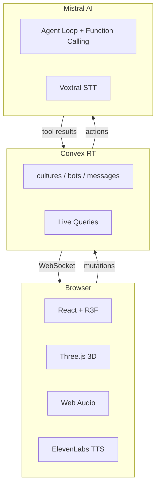

<style>
@import './style.css';
</style>

<h1 class="!text-[3.5em]">
<span class="chaos-wrapper"><span class="chaos-letter">P</span><span class="chaos-letter">R</span><span class="chaos-letter">E</span><span class="chaos-letter">D</span><span class="chaos-letter">I</span><span class="chaos-letter">C</span><span class="chaos-letter">T</span></span>
<br>
<span class="chaos-wrapper"><span class="chaos-letter">C</span><span class="chaos-letter">U</span><span class="chaos-letter">L</span><span class="chaos-letter">T</span><span class="chaos-letter">U</span><span class="chaos-letter">R</span><span class="chaos-letter">E</span></span>
</h1>

## AI Culture Propagation Simulation

<div class="text-center mt-12">

**Watch AI cultures clash. Predict which belief dominates.**


</div>

<div class="absolute bottom-10 left-10 text-sm opacity-60">
Mistral AI Worldwide Hackathon 2026
</div>

---

## Prediction Is the Core of Intelligence

<br>

<div class="grid grid-cols-2 gap-12">
<div>

### Next Token Prediction

- Language models predict the **next token**
- But technically, a world model predicts the **next state**
- Prediction is the fundamental motivation of AI

<br>

> Intelligence is compression. Compression is prediction.

</div>
<div>

### Prediction Markets

- Polymarket, Metaculus  - crowd-sourced forecasting
- Markets aggregate human intuition at scale
- But they only work on **structured, binary outcomes**

<br>

What about **messy, social, emergent** outcomes?

</div>
</div>

---

## The $100M Question

<br>

<div class="grid grid-cols-2 gap-12">
<div>

### Simile AI

- Raised **$100M Series A** (Stanford generative agents team)
- Simulates human behavior at population scale
- Enterprise platform  - locked behind closed doors

<br>

They proved the problem is **worth billions**.

</div>
<div>

### What's Missing

- No consumer product for belief propagation
- No interactive way to **experience** how ideas spread
- No way to test your intuition against AI

<br>

**Can you predict which culture wins  - better than AI can?**

</div>
</div>

---

## Our Solution

<br>

<div class="grid grid-cols-2 gap-8 items-center">
<div>

### Predict Culture

<br>

Convert culture propagation - a real-world, messy, emergent problem - into an **interactive, solvable situation**.

<br>

6 AI bots. Real 3D cities. Random beliefs. Voice interaction.

**You predict. You participate. You score.**

</div>
<div>


</div>
</div>

---

## How It Works

<br>

<div class="grid grid-cols-2 gap-8">
<div>

### Game Flow

1. **Spawn** - 6 AI bots in a real 3D city (OSM data)
2. **Beliefs** - Each bot gets a random cultural belief
3. **Predict** - You pick which belief will dominate
4. **Watch** - Bots walk, debate, persuade each other
5. **Speak** - Use your **voice** to persuade nearby bots
6. **Score** - How many bots believe what you predicted?

</div>
<div>


</div>
</div>

---

## The Bots

<br>

<div class="grid grid-cols-2 gap-8">
<div>

### Each Bot Is a Mistral Agent

- Represents a **country** with a cultural belief
- **Walks** around real city streets autonomously
- **Speaks** to nearby bots (15-unit range)
- **Listens** to arguments and decides if persuaded
- **Changes belief** when genuinely convinced

<br>

Bots form alliances, debate cascades, and cluster by belief. Small nudges create big shifts.

</div>
<div>


</div>
</div>

---

## Agent Tools

<br>

### Mistral Function Calling

Each bot autonomously decides which tool to call every turn.

<br>

| Tool | Description |
|------|-------------|
| `move_to(x, z)` | Walk to a position on the map |
| `speech(message)` | Speak to nearby bots within range |
| `think(thought)` | Internal reasoning (not heard by others) |
| `change_belief(new_belief)` | Adopt a new belief when persuaded |
| `get_state()` | See all bots' beliefs and positions |

---

## Agent Context

<br>

### What Each Bot Sees Every Turn

<br>

- **World state**  - all bots' positions, beliefs, distances
- **Recent chat**  - last messages from nearby bots
- **Own belief**  - current cultural belief to defend or change
- **Nearby bots**  - who is within speaking range (15 units)

<br>

Bots plan autonomously  - no scripted behavior, pure LLM reasoning.

<br>

> Each turn is a fresh Mistral API call with full context injection.

---

## Voice Input

<br>

<div class="grid grid-cols-2 gap-8">
<div>

### You Speak → Bots Listen

1. Hold mic button → speak naturally
2. **Voxtral STT** transcribes your voice
3. Your message appears at your map position
4. Nearby bots hear you on their next turn
5. They may be persuaded to change belief

</div>
<div>

### Why Voice-Only?

- **No copy-paste**  - must persuade through speech
- More natural and immersive
- Tests real persuasion skills
- Showcases **Voxtral** (Mistral Speech-to-Text)

<br>

**Your voice is your only weapon in the culture war.**

</div>
</div>

---

## Spatial Audio

<br>

<div class="grid grid-cols-2 gap-8">
<div>

### Bots Speak → You Hear

1. Bot says something → logged in chat
2. **ElevenLabs TTS** generates speech audio
3. **Web Audio API PannerNode** positions sound in 3D
4. Sound **fades with distance** from camera
5. Multiple bots talking = ambient murmuring

</div>
<div>

### Spatial Audio Stack

```
Bot speech (text)
  → ElevenLabs TTS (audio)
    → PannerNode (3D position)
      → Your speakers (spatial sound)
```

**Closer bots = louder. Far bots = ambient whisper.**

<br>

Each bot has a unique voice positioned in 3D space.

</div>
</div>

---

## Architecture - Overview

<br>



<br>

All communication flows through **Convex WebSocket live queries** - no polling, instant reactivity.

---

## Architecture - Stack

<br>

| Component | Technology |
|-----------|-----------|
| 3D Cities | OpenStreetMap + React Three Fiber |
| AI Agents | Mistral AI (function calling) |
| Voice Input | Voxtral (Mistral STT) |
| Voice Output | ElevenLabs TTS + Web Audio PannerNode |
| Real-time DB | Convex (WebSocket live queries) |

<br>

- **Frontend**  - React + Three.js + Web Audio API
- **Backend**  - Convex serverless (mutations, queries, actions)
- **AI**  - Mistral agent loop with 5 tools per bot per turn
- **Audio**  - ElevenLabs TTS → PannerNode for spatial positioning

---

## Real Cities from OpenStreetMap

<br>

<div class="grid grid-cols-2 gap-8">
<div>

### 7 Real Cities

- 🗽 New York (Times Square)
- 🇬🇧 London (Trafalgar Square)
- 🇫🇷 Paris (Rue de Rivoli)
- 🇯🇵 Tokyo (Shibuya Crossing)
- 🇸🇬 Singapore (Marina Bay)
- 🇺🇸 Los Angeles (Downtown)
- 🇺🇸 San Francisco (Union Square)

Each game picks a random city.

</div>
<div>

### What's Rendered

- **Roads**  - Real street layouts as 3D polylines
- **Buildings**  - Actual footprints extruded to real heights
- **Water**  - Rivers and lakes from OSM
- **Bots**  - Spawned on actual road segments

<br>

**Not procedural generation  - real geography.**

OSM data cached per city for fast loading.

</div>
</div>

---

## Beyond a Game

<br>

<div class="grid grid-cols-2 gap-12">
<div>

### Extendable Platform

- Swap beliefs for any domain  - politics, marketing, misinformation
- Convert **real-world problems** into solvable interactive simulations
- **Dataset generation**  - every game produces labeled belief propagation data

</div>
<div>

### Future Directions

- **Online learning**  - ML models participate as players and judges
- **Agent trace sidebar**  - show full decision chain per bot (tool calls, reasoning, belief changes)
- **Multiplayer**  - humans compete against each other and AI
- **Benchmark**  - standardized test for social reasoning in LLMs

</div>
</div>

---

## Demo

<br>

<div class="text-center text-2xl mt-16">

🎮 **Live Demo**

<br>

*6 AI bots. A real city. Random beliefs.*

*Watch them debate. Speak to them. Change the outcome.*

*Predict the culture.*

</div>
